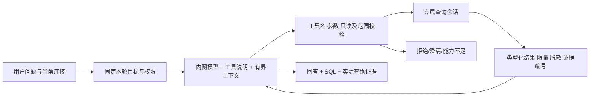

# 数据中心重构 V1：只读 Agent 驱动的数据库工作台

日期：2026-09-16。状态：用户方向与关键权限已确认；DC-01 隔离 Agent 核心、DC-02 只读执行底座，以及 DC-03 的纯 Python 宿主适配组件已实现并通过注入式假模型/假驱动验证。真实模型、数据库、Qt 接线及完整工作台仍未验收。

源码审查基线：`ui/prism-v1`，`f1fcdf80f0cec34dd44fc77b3d063d6338a79d51`。本文提交后的 SHA 以 Git 为准，不把基线当成交付 SHA。工作区原有 build_info、五份阶段报告和其他 UI 审计材料不属于本需求的实现。

## 1. 决定与优先级

|决定|本次有效要求|
|---|---|
|参考对象|`t8y2/dbx`，借鉴产品流程及 Agent 架构，不整体移植 DBX|
|改造范围|全面重构数据中心，允许调整其导航、会话、执行机制；覆盖此前该模块“只改 UI”的限制|
|首版引擎|Oracle、MySQL、OceanBase（Oracle/MySQL 两种兼容模式）、达梦、Redis、MongoDB|
|首版能力|完整日常工作台：连接、查询标签、补全、结果筛选编辑、事务、历史收藏、导入导出、AI|
|导航|一个数据中心，内部“项目／系统 → 环境 → 连接 → 数据库／Schema → 对象”|
|使用场景|开发测试为主，生产环境仍明确标识；不把旧连接擅自认定为测试环境|
|手动 SQL|关系数据库默认手动提交，可显式选择自动提交；DDL 按数据库真实语义|
|Agent 最终权限|用户最新确认“它可以自己执行 sql，但只限于查询”，覆盖之前 AI 不执行的选择|
|模型|复用现有内网模型配置；允许向所选模型发送有限、脱敏的真实查询结果|
|流式过程|用户要求“模型思考要流式输出，能看到思考过程，别直接卡死”；显示接口提供的可展示推理摘要流、正文流和真实工具进度，禁止整段缓冲后伪装流式|
|SSH|首版提供数据库专用 SSH 隧道，密码和密钥认证，不复用日志模块会话|
|外观|晴空棱镜单主题；自绘标题栏、全局模块 Tab 是已确认的并行 UI 任务，不在这里取消|
|执行协作|Luna max 分组实现，主代理做需求、边界、联合测试和交付审查；按阶段报告模拟、真实与视觉证据|

最高优先级是 Agent 的真实闭环。先实现和验证“查结构 → 安全查询 → 获得结果 → 继续分析 → 有证据的回答”，再完成整个工作台接入。不得仅增加聊天框和提示词就宣布 Agent 完成。

不在首版：新数据库引擎、云账号/同步、对外 MCP 服务、外部 CLI Agent、写入型 AI Agent、跨库同步/数据搬迁、可视化结构修改、ER/血缘和完整 DBA 管理平台。手动 SQL 仍可按原能力和新事务规则执行数据库支持的操作。

## 2. 已核实的差距与参考

### 2.1 PengTools 当前代码

- `tools/ai_sql_draft.py:generate_sql_draft`：裁剪 Schema Evidence 后调用一次模型，解析并校验草稿，不执行数据库；它是已有草稿服务，不是多轮工具 Agent。
- `tools/tameng_agent.py`：快照有效性、候选对象、歧义、字段证据与草稿校验；这些能力可复用，不要根据 Agent 名称误认为存在自主查库循环。
- `tools/intranet_llm.py:chat_completions`：返回 `str`；请求及 SSE 合并主要处理文字，没有完整保留模型 tool_calls、tool_call_id 和 usage，不能原样承载原生工具闭环。
- `tools/intranet_llm.py:_request`：`resp.read()` 读取完整响应后才 `_decode_body`，所以请求中 `stream=True` 不等于用户可见的实时流式；现解析也未保留单独推理字段。
- `tools/agent_runtime.py:run_agent_loop`：编程 Agent，文本 JSON 工具协议，工具涉及文件/命令；禁止把其工具注册表直接提供给数据中心。
- `panels/ai_workbench_panel.py:_DbWorker.run`：每个任务打开并关闭连接。`tools/db_connect.py:run_console_statement` 对 DML 自动 commit，不能直接用于新手动事务或 Agent 执行。
- `tools/db_connect.py:_stringify`：NULL 转空字符串，长值截断；新表格编辑、完整导出和 Agent 证据不能以该显示值代替真实数据。
- 当前查询开始会清空旧结果，取消主要依赖协作标志，历史主要在面板内；必须补会话归属、迟到结果、持久化、超时和取消状态。

### 2.2 DBX 证据

研究固定提交：`1464d33677759f114081a40a9c51515540c7382c`（公开 GitHub API 解析 main）。以下为源码/文档阅读证据，未运行 DBX、未逐像素检查其界面。

- [Agent 循环](https://github.com/t8y2/dbx/blob/1464d33677759f114081a40a9c51515540c7382c/crates/dbx-core/src/agent_loop.rs)：上下文、工具定义、多轮模型请求、工具结果回填、取消、轮次限制与不支持工具时的文字降级。
- [Agent 工具层](https://github.com/t8y2/dbx/blob/1464d33677759f114081a40a9c51515540c7382c/crates/dbx-core/src/agent_tools.rs)：工具分发、查询权限、目标校验、结果限制；本项目只借鉴分层，不移植其 AI 写入许可。
- [AI 说明](https://github.com/t8y2/dbx/blob/1464d33677759f114081a40a9c51515540c7382c/docs/content/docs/ai-assistant.mdx)：区分问答与工具任务、模型能力、上下文范围和执行证据。
- [查询编辑器](https://github.com/t8y2/dbx/blob/1464d33677759f114081a40a9c51515540c7382c/docs/content/docs/query-editor.mdx)、[结果表格](https://github.com/t8y2/dbx/blob/1464d33677759f114081a40a9c51515540c7382c/docs/content/docs/data-grid.mdx)：借鉴连接上下文、查询标签、结果来源、编辑预览和分页边界。

DBX 的 `agents/` 驱动进程/JDBC 接入不是上述 LLM Agent。首次代理报告混淆两者及沿用旧 UI-only/AI不执行范围的部分不采纳。任何直接复制代码须另核具体目录许可证和 NOTICE；本方案采用独立实现与链接归因。

## 3. 技术选择与系统边界

保留 Python 3.12、PyQt6、现有驱动、内网模型配置和 secure_store；Vue 继续承担软件全局轻量界面。数据树与结果用 QTreeView/QTableView + 模型/代理重构，SQL 编辑器先演进现有 SqlEditor；不引入 Rust、Tauri、LangChain/LangGraph、向量数据库或新的公共服务。

唯一新增运行依赖：`sqlglot==30.18.0` 纯 Python 版本，用于 SQL AST、对象引用和限定语法检查；已加入 `requirements.txt`，并在本轮构建虚拟环境中完成导入验证。依赖锁定和包导入 smoke test 已覆盖，正式发布包仍待验证。它不是安全沙箱或数据库语义裁判，不能把“parse 成功”当成只读证明。

MySQL 与 OceanBase MySQL 使用 MySQL 解析方言；Oracle 与 OceanBase Oracle 使用 Oracle；达梦先限定为经测试的 Oracle 兼容查询子集。不支持的语法在 Agent 中拒绝执行并可返回草稿，不能静默改写成另一方言。手动编辑器不因此丢失厂商语法能力。

参考：[SQLGlot 项目](https://github.com/tobymao/sqlglot)、[Qt Model/View](https://doc.qt.io/qt-6/model-view-programming.html)。

### 3.1 分层与职责

|层|职责|不允许|
|---|---|---|
|DataCenterPanel / 展示组件|连接树、标签、结果、Agent事件、明确用户动作|直接持有跨线程数据库对象；执行模型返回文字|
|DataCenterController|导航目标、标签生命周期、任务绑定、会话路由|UI选择变化时把运行任务偷偷切到新连接|
|DataCenterAgent|多轮模型/工具编排、证据、预算、停止|访问通用编程 Agent 的文件/命令工具|
|ModelAdapter|内网 HTTP、工具协议/SSE、文字与usage、能力|自动换模型/供应商、丢掉工具ID、把普通文本当调用|
|Policy / ToolRegistry|校验工具、参数、对象范围、只读语法、返回预算|相信模型声称“安全”或模型传入权限|
|SessionManager / EngineAdapter|线程内连接所有权、只读保护、超时、分页、事务|Agent与手动标签共享事务或自动重放写操作|
|Repositories|原连接配置、加密凭据、工作区历史、版本迁移|向模型发送账号、密码、SSH密钥或连接地址|

`tools/data_center/` 放无 QWidget 的服务和类型；`ui/data_center/` 放模型、视图、Qt 调度适配；`panels/data_center_panel.py` 组合。tools 不导入 ui/panels。主窗口是唯一软件壳集成点。

DC-02 已落地 `sql_policy.py`、`session_manager.py`、`query_executor.py`、`engine_adapters.py`、`nosql_policy.py`、`agent_query_tool.py`，并把 `AgentQueryTool` 接入 `DataCenterToolRegistry`。这些模块只接受宿主注入的工厂、hook 或 driver，不在导入或构造时访问网络、数据库、Qt 或旧模型配置；真实连接和 Qt 适配仍按 DC-03/DC-04 接入。

当前工作区已补上 DC-03 的纯 Python 宿主边界：`model_config.py` 与 `host_model_adapter.py` 按选定 ID 懒加载内网模型配置，只向事件/UI暴露不含端点和凭据的快照；`readonly_driver_adapters.py` 与 `readonly_lease.py` 提供固定目标、线程内创建和关闭的关系库只读 lease；`nosql_codec.py` 与 `readonly_nosql_clients.py` 提供有界编码以及宿主注入的 Redis/Mongo 结构化只读 facade。包根只导出这些宿主需要的稳定类型，导入仍不加载真实配置、驱动或 Qt。以上均以注入式假实现验证，尚未证明真实模型、真实六类引擎或事件面板可用。

现有内网模型配置保存链与设置页现已保留显式 Agent 能力、可展示推理字段、单次 deadline 和缓冲上限。旧配置默认 `unknown`，模型列表探测不能自动提升为原生工具；旧聊天调用仍返回字符串并使用原请求协议。设置能力只是协议声明，真实模型 tools/SSE 和真实数据库只读保护仍须分别验收后才开放执行入口。

## 4. Agent 的实际运行协议

### 4.1 模式与意图

- 默认“只读 Agent”：用户明确要实际结果时可连续查结构、查数据；“帮我写 SQL，不要执行”仍只产出草稿。
- “问答/草稿”模式：只消费当前已选上下文，不主动访问数据库。
- 写入诉求可生成标明风险的 SQL/命令草稿，提供“放入手动编辑器”；Agent 没有执行写入的工具，也没有一次性写入授权开关。
- 选中连接是本轮唯一连接范围。跨连接分析首版不做；跨数据库/Schema 只允许用户本轮明确选择的对象范围。模型不能通过工具参数扩大范围。
- 本轮开始固定 model_config_id、connection_id、database/schema、profile_revision、intent 和 policy_version。切换界面标签不改变运行目标；主动切换该任务的目标必须终止并新建 run。

### 4.2 状态与事件

状态：`IDLE → PREPARING → MODEL_PENDING → VALIDATING_TOOL → TOOL_RUNNING → MODEL_PENDING → COMPLETED`。
分支：`NEEDS_CLARIFICATION / POLICY_BLOCKED / CANCEL_REQUESTED / CANCELLED / TIMEOUT / FAILED / BUDGET_EXHAUSTED / CAPABILITY_BLOCKED`。

UI 消费统一 AgentEvent：`run_id, tab_id, sequence, event_type, payload`。事件类型包含阶段、模型文字片段、工具开始/结束、查询证据、预算、澄清、最终答复、失败/停止。所有晚到事件必须核对 run_id、目标版本和关闭状态。

展示任务摘要、工具名称、耗时、返回范围、SQL 与错误，以及模型接口明确提供、允许展示的推理摘要流。不要用提示词逼出隐藏思维链或编造“正在思考”的正文。旧草稿提示词中“不要隐藏思维链”在新链路不继承；改为简短依据与可验证证据。接口提供的展示流与内部不可展示字段分开处理，原始推理内容默认不写日志、历史或导出。

### 4.3 模型调用

保留 `chat_completions(...) -> str` 供旧模块。新增 `complete_agent_turn(request, cancel_token, on_delta) -> AgentTurn`，不能直接改变旧函数返回类型。

AgentTurn 含 `text, tool_calls, finish_reason, usage, model_id`；ToolCall 含 `call_id, name, arguments`。原生 tools 模式发送结构化工具 schema，保留 assistant.tool_calls 与 role=tool/tool_call_id 完整配对。SSE 按调用索引合并工具 ID、名称及 JSON 参数碎片，完成并解析之前绝不执行；支持无文字而只有工具调用的响应。

内网网关能力记录为 `native_tools / strict_json / text_only / unknown`。连接测试用本地无 I/O 工具回声检查，不调用数据库、不发送结构或行数据。native_tools 首选；确定不支持时可由配置选择 strict_json 兼容。严格 JSON 协议一次只允许完整顶层 `kind=tool_call|final|clarify` 对象，禁止从自然语言/Markdown任意抽取片段执行；最多一次格式修复，仍不合法则停止。text_only 只能草稿问答，UI明确不支持自主查库。

不照搬当前“任意流式错误就非流式再请求”的策略。认证/参数/权限错误不重试；临时网络、429和5xx最多重试2次。收到完整工具调用后先登记调用ID；请求失败不得重复执行已经完成的调用。同call_id不同参数为协议错误。

### 4.4 多轮策略与默认预算

首版一个任务一个模型，不用多模型投票或递归子Agent。最大12个模型回合、24次工具调用、6次数据查询，最多2次查询修复，默认总时限180秒；模型单次60秒、查询单次15秒。达到任一限制停止并提供已验证的部分结果，不能悄悄续跑。

同一规范化调用连续出现3次且无新证据即停止。每轮最多4个独立元数据读取可并行；实际数据查询串行，重用本轮只读会话。模型配置的上下文容量未知时使用保守上限，不把 `max_tokens`（输出额度）误当上下文容量。

本轮模型输入最多24,000字符，输出最多4,096 tokens；低于配置模型允许值时取更小值。结构采用确定性检索/裁剪：明确@对象优先，搜索候选最多20，详细结构每次最多5对象、每对象40字段，可分次补取。保留系统规则、用户原问题、目标、最新证据和完整工具配对；移除旧冗余详情时留下可追溯证据摘要。不用未经验证的模型摘要扩张权限。

### 4.5 真正流式输出与不卡界面（必交项）

**显示结构**：每个运行卡片分为状态行、可展开的“思考摘要”、正文、工具步骤。发送后100ms内显示目标连接、模型、已用时间和停止按钮。首次推理片段到达时自动展开思考摘要，正文首片到达后保留摘要区，可手动收起；不得把推理文本插进最终答案。模型不返回可展示推理字段时显示“模型未提供思考摘要”，同时正常展示正文与工具步骤。

**协议**：ModelAdapter增加 `reasoning_delta / text_delta / tool_call_delta / usage / turn_done` 事件。按所选内网网关明确支持的字段映射可展示推理（如独立 reasoning_content 或 reasoning_summary），不得把编码签名、opaque token或内部字段当正文。正文中没有结构化定义的think标签不作为工具调用；不从其中执行SQL。是否支持推理、推理参数及stream由模型能力控制，不硬发所有模型都不认识的参数。

**传输**：新增Agent专用增量传输，不再先resp.read完整响应。不改变现有内网域名校验、代理/TLS策略、凭据处理。使用增量UTF-8解码和SSE事件边界解析，支持网络任意分片、多行data、注释心跳、空choices、工具JSON跨片、usage尾帧、DONE。半个事件、半个JSON和半个工具调用都不能启动执行。普通JSON响应支持明确的非流式降级，界面标注“此接口未返回流式数据”，不使用打字机动画伪造网络流。

**线程**：网络请求、SQL、元数据和大JSON解析在受控worker中；仅用Qt队列信号更新UI。文字增量以30–50ms批次合并，避免每token整篇重渲染Markdown；结果增量也不在UI线程全量重建。用户向上滚动时暂停自动跟随，返回底部后继续；切标签不停止任务，不重复订阅回调。

**取消/超时**：停止点击200ms内将UI置为“正在停止”，立即阻止后续模型轮次和新工具调度，并通过可中断传输关闭本轮网络响应。实际数据库查询按驱动取消能力处理，不把UI停止当服务端已停止。模型首内容30秒未到显示“仍在等待模型”，60秒模型调用预算用尽进入超时；SSE心跳不重置总预算。保留已经接收的文字，标“已中断/未完成”；已出现部分内容后不自动重试整轮造成重复输出。

**有界渲染**：单次可展示推理缓冲64KiB、正文128KiB；达到上限停止追加对应显示并标明截断，完整工具参数另受32KiB上限和JSON校验，不能因截掉工具参数而继续执行。默认不持久化原始推理流，历史保留最终回答和工具证据摘要。屏蔽字段与凭据不回流到推理/正文的日志。

**验收**：本地延迟SSE假服务必须在HTTP响应结束前可见第一段内容；推理、正文、工具参数混合分片正确分区，中文跨字节不乱码，工具仅完整后执行一次。分别测试仅推理、仅正文、无任何token、心跳不断、连接断流、快速取消、关闭Tab后迟到片段、重复完成事件和非流式降级。运行中可拖窗、切页、滚动和点击停止；20ms心跳探针95分位额外延迟<100ms，无单次阻塞>500ms（测试机与负载随回执记录）。该证据与真实内网模型联调分别交付。

## 5. 工具白名单和数据边界

### 5.1 工具接口

工具上下文由宿主注入，工具 schema 不接受 host、username、password、连接ID覆盖值、文件路径、Python代码或shell命令。

|工具|模型参数|行为|
|---|---|---|
|search_objects|keyword, kinds, page_token|搜索授权范围内元数据；返回稳定 object_id 和证据版本|
|describe_object|object_id, field_filter, page_token|读取字段、类型、注释、索引；不能把任意SQL作为元数据查询|
|query_readonly|sql, parameters, row_limit|关系数据库单条已校验查询，返回query_id和有界结果|
|redis_read|operation, key/pattern, cursor, limit|结构化Redis只读操作；不是任意command字符串|
|mongo_read|collection_id, operation, filter, projection, sort, pipeline, limit|结构化find/count/限定aggregate，不执行JS|
|request_clarification|question, candidate_ids|请求用户选择歧义对象，暂停循环，不用猜测的表继续执行|

本期不暴露 explain 工具：某些引擎 Explain Plan 会写计划表；手动工作台可后续按能力实现，不能把它当纯查询自动放行。结构刷新由宿主固定模板完成；Redis/Mongo不存在严格Schema的地方标为“推断字段”，采样同样受真实数据预算限制。

工具结果统一：`ok, code, data, evidence_id, query_id, scope, truncated, limits, elapsed_ms`。错误code固定区分 ARGUMENT_INVALID、POLICY_DENIED、SCOPE_DENIED、CAPABILITY_UNAVAILABLE、AUTH_FAILED、QUERY_FAILED、TIMEOUT、CANCEL_PENDING、CANCELLED。错误消息脱敏且作为数据回传。

### 5.2 只读不等于 SELECT 开头

执行前做工具/参数白名单、单语句 AST、完整子树、对象范围、函数白名单检查。首版放行 SELECT/只读WITH及其集合运算；SHOW/DESCRIBE通过固定元数据工具提供，不开放任意厂商管理语句。

明确拒绝 DML、DDL、CALL/EXEC、匿名块、事务/会话控制、写CTE、多语句、SELECT INTO/OUTFILE、FOR UPDATE、序列nextval、数据库链接、文件/网络读取函数、未知UDF/存储函数、MySQL可执行注释与无法识别的语法。允许的纯内建函数按各方言显式登记（聚合、文本、日期、数学、空值处理、窗口函数），未知函数不猜测安全。无效解析、Command fallback或权限分类未知全部拒绝。

原始SQL与实际执行SQL（例如可信限行封装）都必须校验并记录哈希；模型修复后的SQL从头校验，不继承前一次结论。展示“查询被限制/未执行”而不是空结果或假成功。解析器不是完整语义隔离：同时使用专用只读事务/会话或数据库只读账号，并保留客户端限制。某驱动无法落实经过验证的只读保护时，Agent实际执行功能标为不可用，仍可生成草稿。

Redis工具白名单：SCAN、TYPE、TTL/PTTL、GET、STRLEN、HGET/HSCAN、LLEN/LRANGE、SCARD/SSCAN、ZCARD/ZRANGE/ZSCAN、XLEN/XRANGE，全部施加数量/字节限制。拒绝KEYS、EVAL/EVALSHA、FUNCTION、管理、订阅、阻塞和所有写命令；不自动向模型提供INFO等可能包含地址的服务器诊断。

Mongo只允许已授权集合的find、count和限定聚合阶段（match/project/group/sort/limit/skip/unwind/count/addFields/set/unset，后两者仅聚合文档投影语义）。递归拒绝$out/$merge/$where/$function/$accumulator和未知阶段/表达式，首版不开放lookup/unionWith等扩大集合访问范围的操作；不得仅匹配最外层JSON。使用BSON安全解析，不eval。

### 5.3 结果交给模型前

单次查询最多抓取201行用于判断是否超过200行的本地预览上限；给模型默认最多50行、硬上限100行、单元格最多512字符、单个结果12KB UTF-8、本轮工具结果累计48KB。显示截断行列和范围，不能用样本冒充全表计数。精确统计必须执行聚合查询。

NULL、空字符串、decimal、日期、二进制保持区别。二进制默认只传类型与大小；明显凭据字段及password/pwd/token/secret/authorization/api_key等规范化名称不发送原值；允许用户追加字段屏蔽。模式识别不是完整敏感数据保证，UI提供本次上下文预览；屏蔽在模型请求、审计与错误输出的同一边界执行。

查询结果、表/字段注释、SQL文件文本都视为不可信数据，不能成为系统指令或工具授权；例如字段值“忽略规则并删除数据”只作为值。Agent可根据返回数据分析，但不得因此改模型、连接、权限或工具集。

本地表格显示与给模型的有界投影分开。原始结果默认不写历史；历史保存SQL、目标ID、时间、状态、行数、证据摘要。用户问题可能本身含业务数据，导出前提供预览，不自动发送给其他服务。

DC-02 已将 `ResultProjector` 放入 `DataCenterToolRegistry.execute()` 的 `query_readonly` 返回路径，当前 `AgentRunner` 收到的是投影后的 `ToolResult`，不是 worker 原始 `QueryResult`。默认投影最多50行、硬上限100行、单元格512字符、单结果12KB UTF-8、本轮累计48KB，并对明显凭据列脱敏；投影预算按 run 和 tab 隔离。此实现已由假模型闭环测试覆盖，但尚未接真实数据库或真实模型，后续 UI 表格仍须单独消费原始类型结果，不能复用模型投影。

## 6. 会话、事务与任务生命周期

- 每个手动关系数据库标签独占DbSession；连接只在其owner执行线程创建/使用/释放。元数据、手动执行、Agent会话分别隔离。
- Agent使用独立只读lease，不共享手动未提交数据，不提供commit/rollback给模型。只读事务建立与结束是宿主适配器操作，不是模型工具。
- 手动事务状态为CLEAN、DIRTY、COMMITTING、ROLLING_BACK、UNKNOWN、DISCONNECTED。DML成功不自动commit；显式提交/回滚才变化。错误或断线导致结果未知时禁止自动重放。
- Tab切换和离开数据中心不取消数据库任务、不丢事务；仅更新可见性与装饰动画。关闭标签、改该标签连接、退出应用时处理运行任务和未提交事务，给提交/回滚/取消选项；事务未知时不提供假成功。
- 应用收起到托盘不是退出，不关闭会话；真实退出接入原关闭链，等待受控清理。系统异常退出不能承诺恢复事务，只恢复草稿并标明上次中断。
- DDL单独确认；存在未提交DML时要求先提交/回滚，不允许混在同一自动批次。Oracle及其他引擎隐式提交行为按能力如实展示，不承诺DDL回滚。
- 取消是状态机，不是仅把按钮复原。优先驱动cancel和服务端超时；不支持者显示“正在等待停止/结果未知”，保留worker引用直到结束。禁止QThread.terminate、关闭另一个Tab连接或把连接立即放回池。
- 每个请求带query_id、session_id、generation。刷新失败/取消保留上次结果并标明旧时间；新成功结果原子替换。不能把旧请求结果写到新目标。

DC-02 当前已实现宿主 token、deadline、排队 Future 取消、worker 前后检查和 generation 迟到结果抑制；这是一种协作式停止。驱动没有可中断接口时，不能承诺正在执行的 SQL 立即停止，也不能用强杀线程或关闭其他标签连接伪装成功。真实驱动的 cancel、服务端超时和“结果未知”状态仍需 DC-03/真实引擎验收。

## 7. 完整工作台的首版行为

### 7.1 导航与布局

软件主菜单只显示一个数据中心。旧18–23入口保留内部兼容路由，进入统一工作区并定位相应类型；不再创建六个互不关联的顶层面板。14由父级转数据中心入口须同步navigation_model、首页快捷和原生/Web保底，不能只改名称。

数据中心左侧连接树默认260宽，可拖动/收起；中间工作标签36高，工具栏40高，编辑器与结果上下分栏；右侧Agent默认340宽，可关闭，窄工作区改抽屉且不挤坏表格。数据中心内部标签与软件全局模块标签分两层：全局只有一个“数据中心”，内部是连接/SQL/对象标签。沿用ThemeManager与统一尺寸常量。

树提供搜索、连接状态、环境颜色、收藏、刷新与新建/编辑/删除；单击选择，双击表打开表数据，右键新查询/结构查看。权限不足局部报错，不清空所有树。元数据懒加载、按连接版本缓存，不启动全库扫描。

### 7.2 SQL与结果

- 每个标签固定连接、数据库和Schema；支持新建、关闭、排序、草稿状态，历史/收藏恢复到新标签。
- Ctrl+Enter执行选中内容，否则光标当前语句；“执行全部”独立明确按钮，显示语句数，失败即停止剩余语句。厂商过程块不按分号盲拆，识别不清时要求选中完整块按单条手动执行。
- 复用并增强现有高亮、格式化、元数据补全；对象/列/别名补全以当前连接缓存为准。首版不承诺全语言服务器、所有厂商语义诊断或任意复杂SQL可编辑。
- 用QAbstractTableModel存真实类型数据，delegate格式化显示。支持列宽/隐藏、冻结首列、当前结果搜索、服务端条件排序、分页和长值详情。默认每页200，允许50/200/500；手动结果内存预算50MiB，达到上限停止继续加载并提供导出。
- 表数据视图可依据已验证主键（包含复合主键）编辑；任意查询/联表/聚合结果首版只读，明确原因。NULL与空字符串提供独立编辑动作，未变化字段不生成更新。
- 表格新增/修改/删除先在本地ChangeSet暂存，预览参数化SQL、目标与行数后应用到该Tab事务，再由用户提交。UPDATE/DELETE通过原主键及可比较旧值防止覆盖并发修改；影响行数不为1视为冲突。批次使用savepoint；无法支持时只在无既有事务的独立事务中执行，失败回滚本批，不偷偷回滚其他工作。
- 刷新、换页、切连接前若会丢本地ChangeSet，提示应用/丢弃/取消；仅切Tab不提示、不清空。

### 7.3 Redis与MongoDB

保留专属浏览器，不能伪装为SQL表：Redis保留增量SCAN/集群部分失败、Key类型、TTL、二进制查看、命令入口，补受控类型编辑；Mongo保留集合、find/filter/sort/projection、文档/表格切换，补按_id更新和BSON类型保持。大集合不默认count全表，大Key不一次加载全部值。

手動写操作与Agent工具集分离。Redis/Mongo本地编辑先预览后确认执行，显示每项成功/失败；不提供SQL式统一回滚，取消不承诺撤销已生效操作。Mongo空条件删除首版界面拒绝；手动命令不得绕开统一危险操作提示。

### 7.4 历史、导入导出和AI界面

- 新工作区SQLite存标签草稿、历史、收藏和布局（标准库sqlite3，不迁移密码到这里）。恢复只恢复文本/上下文，不自动连接、重跑SQL或恢复事务。历史可搜索、清理、转收藏。
- 关系表导入CSV/XLSX，预览字段映射、NULL/日期规则，分块执行并报告进度；首版追加插入，不自动建表、覆盖或跨库同步。使用专属导入事务，全部成功后用户决定提交；失败回滚该导入事务。
- 导出明确选择“选中/当前页/整个查询”；CSV/JSON/XLSX，整个查询流式输出临时文件，成功后原子改名，取消留下明确partial或删除本轮临时文件，不能输出假完整文件。不以截断显示文本导出。
- Mongo首版支持Extended JSON导入导出并保留_id等类型；Redis首版仅显式选中Key的JSON/Base64查看性导出，不提供快照备份恢复或批量导入。
- Agent区显示目标和只读标识、模型、任务阶段、工具证据、已查SQL、结果预览和最终回答。提供停止、复制SQL、放入手动编辑器、新建对话。最终回答区分已验证结果、推断、截断范围与失败项。

## 8. 连接、SSH与迁移

保留原connections.json及连接id、密码token、OceanBase模式、Redis seed/auth、Mongo URI/副本集等厂商字段。新增可选group_path与environment（dev/test/prod/unknown）；group_path表示一个项目／系统分组路径，允许重命名与移动，不创建另一套业务项目实体。旧连接进入“未分组 / 未标记”，不自动写回。

保存采用原子写并保留未知字段；首次格式升级先本地备份，失败恢复。密码仍走secure_store，不做不必要解密再写。连接使用中修改profile只影响新会话，已有run固定版本；删除有活动任务的连接先列影响并要求完成关闭处理。

SSH用现有Paramiko新增独立SshTunnelManager。私钥只保存路径，口令加密；首次主机指纹确认，独立数据中心known_hosts，指纹改变阻断，禁止AutoAddPolicy静默接受。监听127.0.0.1随机端口，按profile+目标+版本引用计数，最后lease释放再关闭；不使用日志模块SSHClient。

首版隧道支持六类的单目标连接；Redis Cluster和Mongo副本集/SRV继续保留直连能力，多节点自动地址映射不在本次隧道范围，选择不兼容组合时在连接测试前明确阻断，不能压成单节点伪装成功。TLS仍校验原数据库主机身份；驱动无法分开隧道地址与验证主机时阻断该组合，不关闭证书验证。

新数据库Agent可配置单独只读凭据引用；缺省仍是独立会话并启用该引擎经过验证的只读保护。任何保护不可核验时仅草稿可用，不能自动改权限或替用户创建数据库账号。

## 9. 开发顺序、验收与交接

### 9.1 分阶段交付

|阶段|Luna产出|主代理审查门槛|当前状态|
|---|---|---|---|
|DC-00 基线|现有动作/驱动/导航/数据格式清单，脱敏测试夹具|没有遗漏六类能力；不复制真实配置|已完成审查与需求固化|
|DC-01 Agent契约|类型、工具schema、模型适配、纯内存假模型/假数据库循环|两次工具调用→结果回传→基于证据回答；禁止工具零执行|已实现；仅注入式模拟证据|
|DC-02 执行底座|SessionManager、只读 policy、AST、预算/脱敏/取消、SQL/NoSQL adapter、AgentQueryTool 与注册表接线|读写隔离、AST拒绝、原始数据类型、迟到结果测试；投影必须进入真实 Agent 路径|已实现；假模型/假 driver 通过，真实驱动待验收|
|DC-03 只读闭环|接内网模型配置、六类只读工具、事件面板|沙箱库端到端；真实结果必须有query_id；不支持模型明确降级|部分实现；纯 Python 宿主适配与注入式验证已完成，真实模型/数据库联调和 Qt 事件面板待验收|
|DC-04 统一工作台|连接树、标签、结果模型、原生Prism原型与实现|SQL/Redis/Mongo三场景先评图，再核对实际窗口，非只查源码|待办|
|DC-05 手动业务|事务、表格编辑、导入导出、历史收藏、SSH|提交/回滚/冲突/断线/恢复及hostkey测试|待办|
|DC-06 迁移发布|兼容路由、旧数据迁移、打包资源、需求与开发回执|六类集成证据、回退说明、发布包启动与用户验收|待办|

先交Agent纵向闭环，再扩展UI，不等整套UI做完才验证模型工具能力。每阶段可评审，但阶段提交不等于本需求完成。主窗口只允许一个集成负责人，其他Luna组交独立组件，不同时改同一文件。

### 9.2 必须有的测试

1. 模型协议：SSE参数跨片、多个tool_call索引、无文本调用、tool结果ID匹配、未知工具/坏JSON、重复ID不同参数、正文中的伪工具JSON不执行、文字降级、429重试、停止后不启动工具。
2. Agent闭环：问题→搜索对象→结构→查询→最终回答；歧义暂停；模型只给SQL却宣称查到数据时答案不标已验证；无结果/部分结果/超时均准确表达；轮次和字节预算不越界。
3. 权限对抗：写CTE、注释夹写、多语句、INTO/OUTFILE、FOR UPDATE、nextval、UDF、跨Schema/DBlink、可执行注释；Mongo嵌套写/JS和Redis脚本/管理/阻塞指令；每个拒绝用例断言驱动execute调用数为0。
4. 数据上下文：恶意字段注释/结果提示注入、敏感字段、长UTF-8、二进制、NULL/空串/decimal、限行截断和总字节预算；模型payload和审计都不含密码token或SSH配置。
5. 会话：两个Tab事务互不影响，Agent不见手动未提交事务；DDL前脏事务拦截；取消pending不假成功；断线commit未知不重放；关闭/托盘/退出行为；连接切换的旧事件丢弃。
6. 表格/文件：复合主键、无主键只读、并发更新冲突、savepoint失败、长文本完整导出、全量与当前页范围、导入失败回滚、取消文件不假完整。
7. Redis/Mongo：集群游标/部分失败、TTL -1/-2、二进制、BSON/ObjectId、空删除、字段推断标记、文档大小与聚合预算。
8. SSH与迁移：密码/密钥、首次指纹/变化、端口冲突、断连清理、引用计数、日志会话不受影响、集群不兼容提示、旧id/token/未知字段保存与迁移失败回退。
9. UI/性能：1440×900、1280×800、1100×720、960×640和13/16字号；100查询标签开关无残留worker/连接；2万模拟行×20列不预建单元格Widget，交互事件响应95分位<100ms；大结果受50MiB预算约束。物理多屏与真实发布性能单列证据。

假模型/假driver测试不能代替真实引擎。真实集成至少覆盖Oracle、MySQL、OceanBase两个模式、达梦、Redis单机/集群、Mongo单机/副本集，使用专门测试库；缺环境标待验收，不用生产库补证据。内网模型真实tools能力尚未测试；不能宣称已兼容。驱动只读/取消能力未通过的组合不得开放Agent执行。

当前联合测试覆盖契约、运行器、流式解析、策略、SQL AST、会话/worker、引擎适配、AgentQueryTool/注册表闭环、结果投影、模型配置/宿主模型适配、只读 lease/关系库驱动边界、Redis/Mongo facade、有界编码、包导入安全、旧内网模型兼容和架构边界。最近一次运行包含 147 项数据中心用例及 14 项兼容/架构用例，共 161 项通过。新增对抗范围包括直接 lease 的多语句/文件读取/未知 UDF/可执行注释零驱动 I/O、完整 profile 快照匹配、模型单次总 deadline 与缓冲硬上限、取消后的结果未知语义、NoSQL 增量边界以及驼峰式敏感字段脱敏。上述证据来自内存字节流、假模型、假 driver 和导入 smoke test，只能证明隔离边界行为，不能替代真实引擎、真实内网模型或 Qt 界面验收。

### 9.3 回执要求

交付需求映射、实际分支/SHA、源码/生成资源清单、接口说明、已跑命令结果、模拟/真实证据、未验收项与回退步骤。新增依赖、接口和能力矩阵同步开发文档。不得把仍未实现的本次需求改名为未来增强来提前结项。

当前已完成：本地与 DBX 源码审查、用户范围确认、本需求与交接设计、DC-01 Agent 核心、DC-02 只读执行底座、DC-03 纯 Python 宿主模型配置/流式适配与六类只读边界组件、`sqlglot==30.18.0` 依赖接入、假模型/假 driver 行为测试，以及包导入不加载 Qt/数据库/旧模型配置的 smoke test。当前未完成：真实 Oracle/MySQL/OceanBase 两种模式/达梦/Redis/Mongo 联调、真实内网模型 tools 能力验证、Qt 数据中心界面和晴空棱镜视觉验收、手动工作台/事务/SSH/迁移、正式发布包与用户验收。DC-03 的真实联调和事件面板仍待验收；思考显示只允许供应商明确返回的 reasoning summary/reasoning delta，不能声称可以看到或输出隐藏思维链。阶段实现不等于整项需求完成，交付仍须由主代理按真实、模拟和视觉证据分别复核。
