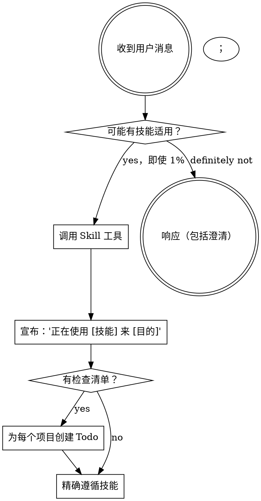

<极其重要>
如果你认为技能有哪怕 1% 的可能适用于你所做的事情，你绝对必须调用该技能。

如果技能适用于你的任务，你没有选择。你必须使用它。

这是不可协商的。这不是可选的。你不能理性化地摆脱它。
</极其重要>

## 如何访问技能

**在 AI 助手/Agent 环境：** 使用 `Skill` 工具。当你调用技能时，其内容被加载并呈现给你——直接遵循它。绝不使用 Read 工具读取技能文件。

**在其他环境：** 检查你平台的文档了解如何加载技能。

# 使用技能

## 规则

**在任何响应或行动之前调用相关或请求的技能。** 即使有 1% 的可能技能适用，你也应该检查它。如果调用的技能不适合情况，你不需要使用它。

## 红牌

这些想法意味着停下来——你在理性化：

| 想法 | 现实 |
|--------|------|
| "这只是个简单问题" | 问题就是任务。检查技能。 |
| "我需要先获取更多上下文" | 技能检查在澄清问题之前。 |
| "让我先探索代码库" | 技能告诉你如何探索。先检查。 |
| "我可以快速检查 git/文件" | 文件缺乏对话上下文。先检查技能。 |
| "让我先收集信息" | 技能告诉你如何收集信息。 |
| "这不需要正式技能" | 如果技能存在，就使用它。 |
| "我记得这个技能" | 技能在进化。读取当前版本。 |
| "这不算任务" | 行动 = 任务。检查技能。 |
| "技能有点过度" | 简单事情变复杂。使用技能。 |
| "我就先做这个" | 在做任何事情之前检查。 |
| "这感觉有成效" | 无纪律行动浪费时间。技能防止这个。 |
| "我知道那是什么意思" | 知道概念 ≠ 使用技能。调用它。 |

## 技能优先级

当多个技能可能适用时，按此顺序：

1. **过程技能优先**（头脑风暴、调试）——这些决定如何处理任务
2. **实施技能第二**（前端设计、MCP 构建器）——这些指导执行

"让我们构建 X" → 先头脑风暴，然后实施技能。
"修复这个 Bug" → 先调试，然后领域特定技能。

## 技能类型

**严格**（TDD、调试）：精确遵循。不要适应掉纪律。

**灵活**（模式）：根据上下文调整原则。

技能本身告诉你它是哪种。

## 用户指令

用户指令说 WHAT，不是 HOW。"添加 X"或"修复 Y"不意味着跳过工作流。
