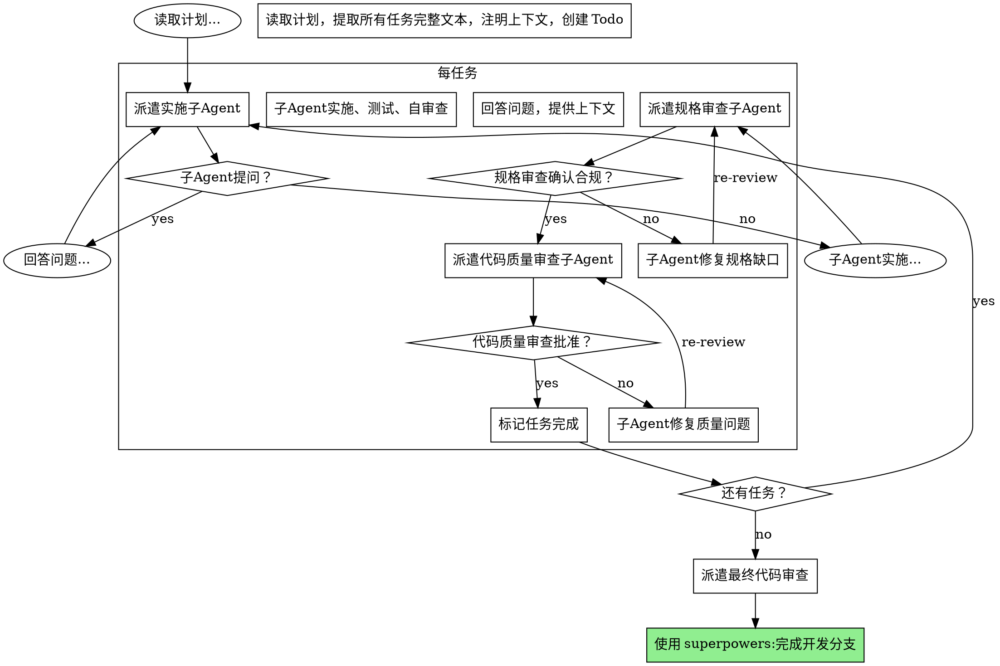

# 子 Agent 驱动开发

## 概述

通过为每个任务派遣新的子 Agent 来执行计划，任务之间进行两阶段审查：首先是规格合规审查，然后是代码质量审查。

**核心原则：** 每个任务一个新子 Agent + 两阶段审查（先规格后质量）= 高质量、快速迭代

## 与执行计划的区别

- **同一会话**（无上下文切换）
- **每个任务一个新子 Agent**（无上下文污染）
- **每个任务后两阶段审查**：先规格合规，后代码质量
- **更快迭代**（任务之间无需人工介入）

## 流程

## 提示词模板

实施子 Agent 提示词应包含：
- 任务的完整文本和上下文
- 项目的关键约束（禁止项、路径规范等）
- 明确的预期输出

规格审查子 Agent 提示词应：
- 对照计划验证每项要求
- 检查是否有遗漏或多余

代码质量审查子 Agent 提示词应：
- 检查代码质量、可维护性
- 检查是否有潜在 Bug

## 质量门禁

- 自审查在移交前捕获问题
- 两阶段审查：规格合规，然后代码质量
- 审查循环确保修复真正有效
- 规格合规防止过度/不足构建
- 代码质量确保实施构建良好

## 红牌

**绝不：**
- 跳过审查（规格合规或代码质量）
- 用未修复问题继续
- 在规格合规审查之前开始代码质量审查（错误顺序）
- 在任一审查有未解决问题时移动到下一个任务
- 让子 Agent 自审查代替实际审查（两者都需要）

## 集成

**必需工作流技能：**
- **superpowers:撰写计划** - 创建此技能执行的计划
- **superpowers:请求代码审查** - 审查者子 Agent 的代码审查模板
- **superpowers:完成开发分支** - 所有任务完成后的完整开发

**子 Agent 应使用：**
- **superpowers:测试驱动开发** - 每个任务遵循 TDD

**替代工作流：**
- **superpowers:执行计划** - 用于并行会话而不是同会话执行
