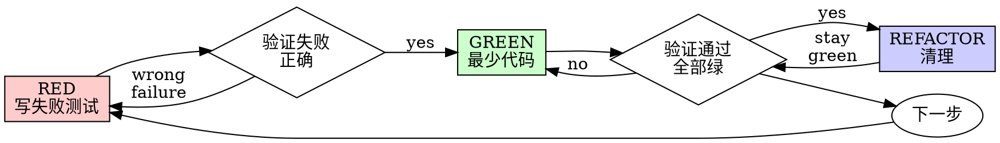

# 测试驱动开发（TDD）

## 概述

先写测试。看到它失败。写最少的代码通过。

**核心原则：** 如果你没有看到测试失败，你就不确定它测试的是正确的东西。

**违反规则的文字就是违反规则的精神。**

## 何时使用

**总是：**
- 新功能
- Bug 修复
- 重构
- 行为变更

**例外（询问用户）：**
- 一次性原型
- 生成的代码
- 配置文件

在想"这次跳过 TDD"？停下来。这是理性化。

## 铁律

```
没有失败测试就不写生产代码
```

在测试之前写代码？删除它。重来。

**没有例外：**
- 不要保留它作为"参考"
- 不要在写测试时"改编"它
- 不要看它
- 删除就是删除

从头根据测试重新实现。就这样。

## 红-绿-重构



### RED - 写失败测试

写一个最小的测试，展示应该发生什么。

**好：**
```python
def test_retries_failed_operations_3_times():
    attempts = 0
    def operation():
        nonlocal attempts
        attempts += 1
        if attempts < 3:
            raise Error('fail')
        return 'success'

    result = retry_operation(operation)
    assert result == 'success'
    assert attempts == 3
```
名称清晰，测试真实行为，一次一件事

**坏：**
```python
def test_retry_works():
    mock = Mock(side_effect=[Error(), Error(), 'success'])
    retry_operation(mock)
    assert mock.call_count == 3
```
名称模糊，测试 mock 而不是代码

**要求：**
- 一个行为
- 清晰的名称
- 真实代码（除非不可避免否则不用 mock）

### 验证 RED - 看着它失败

**强制执行。绝不跳过。**

```bash
pytest tests/path/test_file.py::test_name -v
```

确认：
- 测试失败（不是错误）
- 失败消息是预期的
- 因为功能缺失而失败（不是拼写错误）

**测试通过了？** 你在测试现有行为。修复测试。

**测试错误？** 修复错误，重新运行直到正确失败。

### GREEN - 最少代码

写最简单的代码让测试通过。

**好：**
```python
def retry_operation(fn, max_retries=3):
    for i in range(max_retries):
        try:
            return fn()
        except Exception as e:
            if i == max_retries - 1:
                raise
```
刚好够用

**坏：**
```python
def retry_operation(fn, max_retries=3, backoff='linear',
                     on_retry=None, ...):
    # YAGNI
```
过度工程

不要添加功能、重构其他代码，或在测试要求之外做任何"改进"。

### 验证 GREEN - 看着它通过

**强制执行。**

```bash
pytest tests/path/test_file.py::test_name -v
```

确认：
- 测试通过
- 其他测试仍然通过
- 输出干净（无错误、无警告）

**测试失败？** 修代码，不是测试。

**其他测试失败了？** 立即修复。

### REFACTOR - 清理

只有在 green 之后：
- 移除重复
- 改进名称
- 提取辅助函数

保持测试 green。不要添加行为。

### 重复

下一个失败测试对应下一个功能。

## 好测试

| 质量 | 好 | 坏 |
|--------|------|-----|
| **最小** | 一次一件事。名称里有"和"？拆开。 | `test('验证邮箱和域名和空格')` |
| **清晰** | 名称描述行为 | `test('test1')` |
| **展示意图** | 展示期望的 API | 掩盖代码应该做什么 |

## 为什么顺序重要

**"我之后写测试来验证它有效"**

代码之后写的测试立即通过。立即通过什么都证明不了：
- 可能测试了错误的东西
- 可能测试了实现，而不是行为
- 可能遗漏了你忘记的边界情况
- 你从未见过它捕获 Bug

测试优先迫使你看到测试失败，证明它实际测试了某些东西。

**"我已经手动测试了所有边界情况"**

手动测试是随意的。你认为测试了一切但：
- 没有记录你测试了什么
- 代码变化时无法重新运行
- 在压力下容易忘记情况
- "我试的时候它工作了"≠ 全面

自动化测试是系统性的。它们每次以相同方式运行。

**"删除 X 小时的工作是浪费"**

沉没成本谬误。时间已经过去了。你的选择：
- 删除并用 TDD 重写（再多 X 小时，高置信度）
- 保留它并在之后添加测试（30 分钟，低置信度，很可能出 Bug）

"浪费"是保留你无法信任的代码。没有真正测试的工作代码是技术债务。

## 常见理性化

| 借口 | 现实 |
|--------|------|
| "太简单不用测" | 简单代码也会坏。测试只需 30 秒。 |
| "我之后测" | 测试立即通过什么都证明不了。 |
| "之后测也能达到同样目标" | 之后测 = "这做什么？" 测试优先 = "这应该做什么？" |
| "已经手动测过了" | 随意 ≠ 系统。没有记录，无法重新运行。 |
| "删除 X 小时太浪费" | 沉没成本谬误。保留未验证代码是技术债务。 |
| "留着作参考，写测试时改编" | 你会改编它。这就是之后测试。删除就是删除。 |
| "需要先探索" | 可以。丢弃探索，从 TDD 开始。 |
| "测试难 = 设计不清楚" | 听测试的。难测试 = 难使用。 |
| "TDD 会拖慢我" | TDD 比调试快。务实 = 测试优先。 |
| "手动测试更快" | 手动不能证明边界情况。每次变化都要重新测试。 |
| "现有代码没测试" | 你在改进它。为现有代码添加测试。 |

## 红牌 - 停下来重新开始

- 代码在测试之前
- 实现后写测试
- 测试立即通过
- 无法解释为什么测试失败
- "之后"添加测试
- 理性化"就这一次"
- "我已经手动测试过了"
- "之后测也能达到同样目的"
- "这是关于精神不是仪式"
- "留着作参考"或"改编现有代码"
- "已经花了 X 小时，删除太浪费"
- "TDD 是教条的，我更务实"
- "这不一样因为……"

**所有这些意味着：删除代码。从 TDD 重新开始。**

## 示例：Bug 修复

**Bug：** 接受空邮箱

**RED**
```python
def test_rejects_empty_email():
    result = submit_form({'email': ''})
    assert result.error == 'Email required'
```

**验证 RED**
```bash
$ pytest
FAIL: expected 'Email required', got undefined
```

**GREEN**
```python
def submit_form(data):
    if not data.email.strip():
        return {'error': 'Email required'}
    # ...
```

**验证 GREEN**
```bash
$ pytest
PASS
```

**REFACTOR**
如需要，提取多字段验证。

## 验证清单

在标记工作完成之前：

- [ ] 每个新函数/方法都有测试
- [ ] 在实现之前看过每个测试失败
- [ ] 每个测试失败原因符合预期（功能缺失，不是拼写错误）
- [ ] 写了最少的代码让每个测试通过
- [ ] 所有测试通过
- [ ] 输出干净（无错误、无警告）
- [ ] 测试使用真实代码（除非不可避免否则不用 mock）
- [ ] 覆盖了边界情况和错误

不能勾选所有框？你跳过了 TDD。重来。

## 调试集成

发现 Bug？写一个失败测试来复现它。遵循 TDD 循环。测试证明修复并防止回归。

永远不要在没有测试的情况下修复 Bug。

## 最终规则

```
生产代码 → 测试存在且先失败
否则 → 不是 TDD
```

未经用户许可没有例外。
