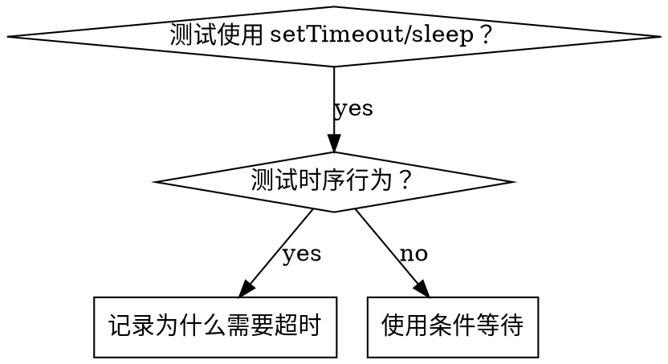

# 条件等待

## 概述

不稳定的测试通常用任意延迟猜测时间。这会造成竞态条件，测试在快机器上通过但在负载下或 CI 中失败。

**核心原则：** 等待你关心的实际条件，而不是猜测需要多长时间。

## 何时使用



**使用当：**
- 测试有任意延迟（`setTimeout`、`sleep`、`time.sleep()`）
- 测试不稳定（有时通过，负载下失败）
- 测试在并行运行时超时
- 等待异步操作完成

**不要使用当：**
- 测试实际时序行为（防抖、节流间隔）
- 总是记录为什么使用任意超时

## 核心模式

```python
# ❌ 之前：猜测时间
import time
time.sleep(0.05)
result = get_result()
assert result is not None

# ✅ 之后：等待条件
def wait_for(condition_fn, timeout=5.0, interval=0.01):
    """等待条件函数返回真值，超时后抛出异常。"""
    start = time.time()
    while True:
        result = condition_fn()
        if result:
            return result
        if time.time() - start > timeout:
            raise TimeoutError(f'等待条件超时: {condition_fn}')
        time.sleep(interval)

result = wait_for(lambda: get_result())
assert result is not None
```

## 快速模式

| 场景 | 模式 |
|----------|------|
| 等待事件 | `wait_for(lambda: len([e for e in events if e.type == 'DONE'])) > 0` |
| 等待状态 | `wait_for(lambda: machine.state == 'ready')` |
| 等待计数 | `wait_for(lambda: len(items) >= 5)` |
| 等待文件 | `wait_for(lambda: os.path.exists(path))` |
| 复杂条件 | `wait_for(lambda: obj.ready and obj.value > 10)` |

## 实现

通用轮询函数：
```python
import time

def wait_for(condition, description, timeout_ms=5000):
    start_time = time.time()
    interval = 0.01  # 每 10ms 轮询

    while True:
        result = condition()
        if result:
            return result

        elapsed_ms = (time.time() - start_time) * 1000
        if elapsed_ms > timeout_ms:
            raise TimeoutError(
                f'等待 {description} 超时，已过 {elapsed_ms:.0f}ms'
            )

        time.sleep(interval)
```

## 常见错误

**❌ 轮询太快：** `time.sleep(0.001)` ——浪费 CPU
**✅ 修复：** 每 10ms 轮询

**❌ 无超时：** 循环永远运行如果条件永不满足
**✅ 修复：** 总是包含带清晰错误消息的超时

**❌ 缓存状态：** 在循环前缓存状态
**✅ 修复：** 在循环内调用 getter 获取新数据

## 任意超时确实正确的场景

```python
# 工具每 100ms tick 一次——需要 2 次 tick 来验证部分输出
wait_for_event(manager, 'TOOL_STARTED')  # 首先：等待条件
time.sleep(0.2)  # 然后：等待时序行为
# 200ms = 100ms 间隔的 2 次 tick——有记录且有理由
```

**要求：**
1. 首先等待触发条件
2. 基于已知时序（不是猜测）
3. 注释解释为什么

## 实际影响

从调试会话（2025-10-03）：
- 修复了 3 个文件中 15 个不稳定测试
- 通过率：60% → 100%
- 执行时间：快 40%
- 不再有竞态条件
