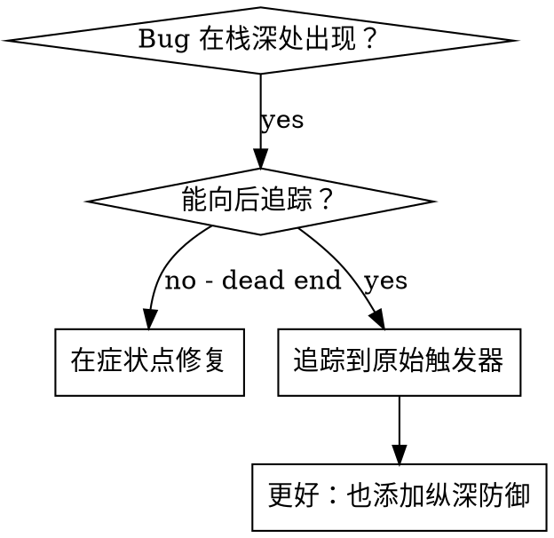
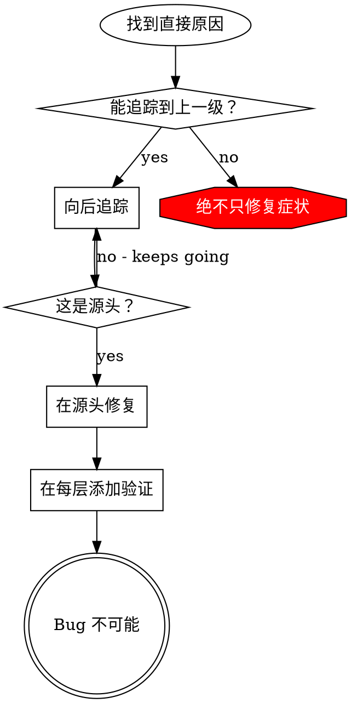

# 溯源追踪

## 概述

Bug 通常在调用栈深处表现（git init 在错误目录、文件创建在错误位置、数据库用错误路径打开）。你的直觉是在错误出现的地方修复，但那只是治疗症状。

**核心原则：** 通过调用链向后追踪直到找到原始触发器，然后在源头修复。

## 何时使用



**使用当：**
- 错误发生在执行深处（不在入口点）
- 堆栈跟踪显示长调用链
- 不清楚无效数据从哪里起源
- 需要找到哪个测试/代码触发了问题

## 追踪过程

### 1. 观察症状
```
错误：git init 在 /Users/project/packages/core 失败
```

### 2. 找到直接原因
**什么代码直接导致这个？**
```python
subprocess.run(['git', 'init'], cwd=project_dir)
```

### 3. 问：谁调用了这个？
```python
WorktreeManager.create_session_worktree(project_dir, session_id)
  → 被 Session.initialize_workspace() 调用
  → 被 Session.create() 调用
  → 被 test at Project.create() 调用
```

### 4. 继续向上追踪
**传递了什么值？**
- `project_dir = ''`（空字符串！）
- 空字符串作为 `cwd` 解析为 `os.getcwd()`
- 那是源代码目录！

### 5. 找到原始触发器
**空字符串从哪里来？**
```python
context = setup_core_test()  # 返回 { temp_dir: '' }
Project.create('name', context.temp_dir)  # 在 beforeEach 之前访问！
```

## 添加堆栈跟踪

当你无法手动追踪时，添加工具：

```python
def git_init(directory):
    import traceback
    print('DEBUG git init:', {
        'directory': directory,
        'cwd': os.getcwd(),
        'stack': traceback.format_exc(),
    }, file=sys.stderr)
    subprocess.run(['git', 'init'], cwd=directory, check=True)
```

**关键：** 在测试中使用 `print()` 而不是日志——日志可能被抑制

**运行并捕获：**
```bash
pytest 2>&1 | grep 'DEBUG git init'
```

**分析堆栈跟踪：**
- 寻找测试文件名
- 找到触发调用的行号
- 识别模式（同一个测试？同一个参数？）

## 找到哪个测试导致污染

如果某东西在测试中出现但不知道是哪个测试：

使用 bisection 脚本 `find-polluter.sh`：

```bash
./find-polluter.sh '.git' 'src/**/*.test.ts'
```

逐个运行测试，在第一个污染者处停止。参见脚本用法。

## 真实示例：空 project_dir

**症状：** `.git` 创建在 `packages/core/`（源代码）

**追踪链：**
1. `git init` 在 `os.getcwd()` 运行 ← 空 cwd 参数
2. WorktreeManager 用空 project_dir 调用
3. Session.create() 传递了空字符串
4. 测试在 beforeEach 之前访问了 `context.temp_dir`
5. setup_core_test() 最初返回 `{ temp_dir: '' }`

**根本原因：** 访问空值的顶层变量初始化

**修复：** 使 temp_dir 成为一个在 beforeEach 之前访问时抛出异常的 getter

**也添加了纵深防御：**
- 第 1 层：Project.create() 验证目录
- 第 2 层：WorkspaceManager 验证不为空
- 第 3 层：NODE_ENV guard 拒绝在 tmpdir 外 git init
- 第 4 层：git init 前的堆栈跟踪日志

## 关键原则



**绝不在错误出现的地方修复。** 追溯找到原始触发器。

## 堆栈跟踪技巧

**在测试中：** 使用 `print()` 而不是日志——日志可能被抑制
**在操作之前：** 在危险操作之前记录，而不是之后
**包含上下文：** 目录、cwd、环境变量、时间戳
**捕获堆栈：** `traceback.format_exc()` 显示完整调用链

## 实际影响

从调试会话（2025-10-03）：
- 通过 5 级追踪找到根本原因
- 在源头修复（getter 验证）
- 添加 4 层防御
- 1847 个测试通过，零污染
